# ms-transaction-bank

Java microservice for managing bank transactions (transfers, payments and transaction queries).

## Overview

This project implements a lightweight service for recording, validating and querying financial transactions between accounts. It is designed to be simple, testable, and ready for integration in a microservices architecture.

## Architecture
This project follows the Hexagonal Architecture (Ports & Adapters) principles, isolating business rules (domain) from infrastructure details such as REST, Kafka, and the database. <br/>
I implemented Change Data Capture (CDC) using Kafka Connect with the Debezium PostgreSQL Source connector, configured to monitor the database's write-ahead log (WAL) via logical replication (the pgoutput plugin). This way, any change persisted to the table is automatically propagated to a Kafka topic, without the need to implement a manual producer in the application — the application's sole responsibility becomes persisting data correctly to the database, while the asynchronous propagation of events is delegated to the CDC infrastructure.

```mermaid
%%{init: {'theme':'dark'}}%%
flowchart TB
    subgraph IN["🔵 Adapters IN"]
        REST["REST Controller<br/>TransferController"]
        KAFKA_IN["Kafka Consumers<br/>audit / serdes / transaction"]
    end

    subgraph APP["🟡 Application"]
        UC["TransferUseCase"]
    end

    subgraph DOMAIN["🟢 Domain (core)"]
        INPORT["Input Port<br/>TransferUseCasePort"]
        MODEL["Model<br/>Transfer, TransactionKey,<br/>Status, TransactionType,<br/>ForbiddenWords"]
        EXC["Exceptions<br/>DomainException,<br/>TransactionFormatMessageException"]
        OUTPORT["Output Ports<br/>TransactionRepositoryPort,<br/>TransactionEventPublishPort,<br/>AuditEventPublishPort"]
    end

    subgraph OUT["🔴 Adapters OUT"]
        KAFKA_OUT["Kafka Publishers<br/>TransactionPublishAdapter,<br/>AuditTransactionPublishAdapter"]
        REPO["Repositories<br/>transaction / audit"]
    end

    subgraph INFRA["⚙️ Infrastructure"]
        DB[("PostgreSQL /<br/>Flyway migrations")]
        KFK[("Kafka<br/>Broker + Connect")]
    end

    REST --> INPORT
    KAFKA_IN --> INPORT
    INPORT --> UC
    UC --> MODEL
    UC --> EXC
    UC --> OUTPORT
    OUTPORT --> KAFKA_OUT
    OUTPORT --> REPO
    KAFKA_OUT --> KFK
    REPO --> DB

    style DOMAIN fill:#1a3a1a,stroke:#4ade80,stroke-width:2px
    style APP fill:#3a3a1a,stroke:#facc15,stroke-width:2px
    style IN fill:#1a2a3a,stroke:#60a5fa,stroke-width:2px
    style OUT fill:#3a1a1a,stroke:#f87171,stroke-width:2px
    style INFRA fill:#2a2a2a,stroke:#9ca3af,stroke-width:2px
```


The flow follows the dependency rule of hexagonal architecture: adapters (in/out) depend on the domain, never the other way around. The domain has no knowledge of Kafka, REST, or the database — only its own ports (interfaces).

## Directory Structure
```
src/main/
├── avro/                                 # Avro schemas used for Kafka event serialization
├── java/com.lauro.correia.transactionbank/
│   │
│   ├── application/                      # Application use cases (orchestration)
│   │   └── TransferUseCase                   → Implements the orchestration logic for a transfer
│   │
│   ├── domain/                           # Core business logic — no dependency on external technologies
│   │   ├── input.port/                       # Input ports (contracts exposed by the application)
│   │   │   └── TransferUseCasePort                → Interface for the transfer use case
│   │   │
│   │   ├── model/                             # Entities, value objects, and domain exceptions
│   │   │   ├── exception/
│   │   │   │   ├── DomainException                    → Base domain exception
│   │   │   │   └── TransactionFormatMessageException  → Exception for transaction message formatting
│   │   │   └── transaction/
│   │   │       ├── ForbiddenWords                     → Enum/list of forbidden words (validation)
│   │   │       ├── Status                             → Transaction status enum
│   │   │       ├── TransactionKey                     → Transaction key/identifier
│   │   │       ├── TransactionType                     → Transaction type enum
│   │   │       └── Transfer                            → Main transfer entity
│   │   │
│   │   └── output.port/                       # Output ports (contracts the domain requires from infrastructure)
│   │       ├── AuditEventPublishPort              → Contract for publishing audit events
│   │       ├── TransactionEventPublishPort        → Contract for publishing transaction events
│   │       └── TransactionRepositoryPort          → Contract for transaction persistence
│   │
│   ├── infrastructure.adapters/          # Concrete implementations of the ports (technical details)
│   │   ├── in/                                # Input adapters (what "drives" the domain)
│   │   │   ├── kafka/
│   │   │   │   ├── audit/                         → Consumers related to audit events
│   │   │   │   ├── serdes/                        → Custom serializers/deserializers
│   │   │   │   └── transaction/                   → Consumers related to transaction events
│   │   │   └── rest.transfer/
│   │   │       ├── TransferController             → REST endpoint for requesting transfers
│   │   │       └── TransferDTO                     → Input/output DTO for the REST API
│   │   │
│   │   └── out/                               # Output adapters (implementations of the output ports)
│   │       ├── kafka/
│   │       │   ├── AuditTransactionPublishAdapter → Publishes audit events to Kafka
│   │       │   └── TransactionPublishAdapter      → Publishes transaction events to Kafka
│   │       └── repository/
│   │           ├── audit/                         → Audit persistence implementation
│   │           └── transaction/                   → Transaction persistence implementation
│   │
│   └── MsTransactionBankApplication          # Main class (Spring Boot bootstrap)
│
└── resources/
    ├── db/migration/                     # Flyway database versioning scripts
    │   ├── V1__CREATE_SCHEMA.sql             → Initial schema creation
    │   ├── V2__CREATE_TABLE_TRANSACTION.sql  → Transaction table creation
    │   └── V3__CREATE_TABLE_AUDIT.sql        → Audit table creation
    └── application.yaml                  # Application configuration (Spring, Kafka, DB, etc.)
```

## Key features

- Record transactions (send/receive)
- Basic transaction validation (accounts, amounts, status)
- Query transactions by account, ID and date range
- Designed for integration with Kafka for event streaming and CDC

## Technologies

- Java 25+ (or a compatible version)
- Frameworks: Spring Boot 
- Database: Postgres (via Docker)
- Messaging & CDC: Apache Kafka, Kafka Connect, Debezium (Postgres), Apache Avro and Schema registry
- Observability / UI: Kafka UI (for browsing topics)
- Build: Maven 
- Containerization: Docker / Docker Compose

> Note: adjust `pom.xml` and Docker images/versions to match the actual project configuration.

## Requirements

- JDK 25 or newer
- Maven
- Docker & Docker Compose (to run Postgres, Kafka, Connect, Debezium, etc.)

## Running application

1. Clone the repository:

   git clone https://github.com/LauroSilveira/ms-transaction-bank.git
   cd ms-transaction-bank

2. Build the project (Maven):

   mvn clean package

> Note: Since the project uses Apache Avro, after compilation all Avro files will be in `target/generated-sources`, make sure to mark them as generated-source.

3. Run:

   java -jar target/ms-transaction-bank-0.0.1-SNAPSHOT.jar

4. The API will be available at http://localhost:8080 (adjust as configured)

## Docker / Docker Compose
**First execute docker compose.**<br/>
This project expects Postgres to run in Docker for local development.<br />
The system also integrates with Kafka, Kafka Connect and Debezium for CDC and uses a Kafka UI to inspect topics. <br /> 
Below is a simple example docker-compose snippet to start Postgres plus a Kafka stack — adapt versions and configuration as needed.

```yaml
name: ms-transaction-back

services:
  debezium:
    image: debezium/postgres:17-alpine
    container_name: debezium
    environment:
      POSTGRES_DB:  ${POSTGRES_DB}
      POSTGRES_USER: ${POSTGRES_USER}
      POSTGRES_PASSWORD: ${POSTGRES_PASSWORD}
    ports:
      - '5432:5432'
    volumes:
      - postgres_data:/var/lib/postgresql/data

  broker:
    image: apache/kafka:4.3.1
    hostname: broker
    container_name: broker
    ports:
      - "9092:9092"
    environment:
      KAFKA_BROKER_ID: 1
      KAFKA_LISTENER_SECURITY_PROTOCOL_MAP: PLAINTEXT:PLAINTEXT,PLAINTEXT_HOST:PLAINTEXT,CONTROLLER:PLAINTEXT
      KAFKA_ADVERTISED_LISTENERS: PLAINTEXT://broker:29092,PLAINTEXT_HOST://localhost:9092
      KAFKA_OFFSETS_TOPIC_REPLICATION_FACTOR: 1
      KAFKA_GROUP_INITIAL_REBALANCE_DELAY_MS: 0
      KAFKA_TRANSACTION_STATE_LOG_MIN_ISR: 1
      KAFKA_TRANSACTION_STATE_LOG_REPLICATION_FACTOR: 1
      KAFKA_PROCESS_ROLES: broker,controller
      KAFKA_NODE_ID: 1
      KAFKA_CONTROLLER_QUORUM_VOTERS: 1@broker:29093
      KAFKA_LISTENERS: PLAINTEXT://broker:29092,CONTROLLER://broker:29093,PLAINTEXT_HOST://0.0.0.0:9092
      KAFKA_INTER_BROKER_LISTENER_NAME: PLAINTEXT
      KAFKA_CONTROLLER_LISTENER_NAMES: CONTROLLER
      KAFKA_LOG_DIRS: /tmp/kraft-combined-logs
      CLUSTER_ID: ${KAFKA_CLUSTER_ID}
      KAFKA_LOG_RETENTION_MS: 500000 # 5 minutes
      KAFKA_LOG_RETENTION_BYTES: 104857600 # 100MB retention time, optional
      KAFKA_LOG_SEGMENT_BYTES: 10485760 # 10MB
      KAFKA_LOG_RETENTION_CHECK_INTERVAL_MS: 60000 # 1 minute before delete

  schema-registry:
    image: confluentinc/cp-schema-registry:8.2.2
    container_name: schema-registry
    ports:
      - "8085:8081"
    environment:
      SCHEMA_REGISTRY_HOST_NAME: schema-registry
      SCHEMA_REGISTRY_KAFKASTORE_BOOTSTRAP_SERVERS: PLAINTEXT://broker:29092
      SCHEMA_REGISTRY_LISTENERS: http://0.0.0.0:8081
    depends_on:
      - broker
  kafka-connect:
    build:
      context: .
      dockerfile: Dockerfile-kafka-connect
    container_name: kafka_connect
    ports:
      - "8083:8083"
    environment:
      CONNECT_BOOTSTRAP_SERVERS: broker:29092
      CONNECT_REST_PORT: 8083
      CONNECT_REST_ADVERTISED_HOST_NAME: kafka_connect
      CONNECT_GROUP_ID: kafka-connect-group
      CONNECT_CONFIG_STORAGE_TOPIC: connect-configs
      CONNECT_OFFSET_STORAGE_TOPIC: connect-offsets
      CONNECT_STATUS_STORAGE_TOPIC: connect-status
      CONNECT_CONFIG_STORAGE_REPLICATION_FACTOR: 1
      CONNECT_OFFSET_STORAGE_REPLICATION_FACTOR: 1
      CONNECT_STATUS_STORAGE_REPLICATION_FACTOR: 1
      CONNECT_KEY_CONVERTER: io.confluent.connect.avro.AvroConverter
      CONNECT_VALUE_CONVERTER: io.confluent.connect.avro.AvroConverter
      CONNECT_KEY_CONVERTER_SCHEMA_REGISTRY_URL: http://schema-registry:8081
      CONNECT_VALUE_CONVERTER_SCHEMA_REGISTRY_URL: http://schema-registry:8081
      CONNECT_PLUGIN_PATH: /usr/share/java,/usr/share/confluent-hub-components
    depends_on:
      - broker
      - schema-registry

  kafka-ui:
    image: kafbat/kafka-ui:latest
    container_name: kafka-ui
    ports:
      - "8081:8080"
    environment:
      KAFKA_CLUSTERS_0_NAME: local
      KAFKA_CLUSTERS_0_BOOTSTRAPSERVERS: broker:29092
      KAFKA_CLUSTERS_0_SCHEMAREGISTRY: http://schema-registry:8081
      KAFKA_CLUSTERS_0_KAFKACONNECT_0_NAME: connect
      KAFKA_CLUSTERS_0_KAFKACONNECT_0_ADDRESS: http://kafka-connect:8083
    depends_on:
      - broker

volumes:
  postgres_data:
```
## Setup Postgres-connector
Go to Kafbat UI in http://localhost:8081 and click on Kafka Connect -> Create Connector and paste this configuration:
Do not forget to replace user and password database file path to your. <br/>

Name:
```
postgres-connector
```

Config:
```json
{
  "connector.class": "io.debezium.connector.postgresql.PostgresConnector",
  "database.hostname": "debezium",
  "database.port": "5432",
  "database.user": "${file:/secrets/debezium.properties:database.user}",
  "database.password": "${file:/secrets/debezium.properties:database.password}",
  "database.dbname": "transaction_db",
  "topic.prefix": "transaction_db",
  "plugin.name": "pgoutput",
  "slot.name": "debezium_slot",
  "publication.autocreate.mode": "filtered",
  "schema.include.list": "transactions",
  "table.include.list": "transactions.bank_transaction"
}
```
> * Note that the configurations of user and password database are referenced on a file, replace them with your database details password, or put these values in the following file:
```properties
# --- PostgreSQL / Debezium ---
POSTGRES_DB=transaction_db
POSTGRES_USER=your_user
POSTGRES_PASSWORD=your_password
POSTGRES_HOST:your_postgres_localhost

# --- Kafka ---
# It can be any single string in base64 format (22 characters).
# Generate a new one with: docker run --rm apache/kafka:4.3.1 kafka-storage.sh random-uuid
KAFKA_CLUSTER_ID=your_cluster_id
```

## Build/Run Docker image

If you want to run on docker you will need build the image:
```shell
docker build -t ms-transfer-bank .
```
Then run it:
```shell
docker run -p 8080:8080 ms-transfer-bank
```

## Request Example

Notice I am using Postman environment variables and also using this pre-request to create LocalDateTime without UTC cone. 
```
const now = new Date().toISOString().slice(0, -1); 
pm.variables.set("localDateTimeNow", now);
```
```curl
postman request POST 'http://localhost:8080/transfer' \
  --header 'Content-Type: application/json' \
  --body '{
    "transactionId": "35e1f53a-c16f-4c43-aed8-54a2dd3adcff",
    "description": "Transferencia de Tasha Fay",
    "amount": "463.59",
    "transferAt": "{{localDateTimeNow}}",
    "status": "PENDING",
    "transactionType": "CREDIT"
}'
```

## Schema registry endpoints
Returns all schemas
```curl
curl --location 'http://localhost:8085/subjects'
```

Get a specific version of a schema. 
```curl
curl --location 'http://localhost:8085/subjects/transaction_db.transactions.bank_transaction-key/versions'
```

Get latest info about a schema.
```curl
curl --location 'http://localhost:8085/subjects/transaction_db.transactions.bank_transaction-value/versions/latest'
```
